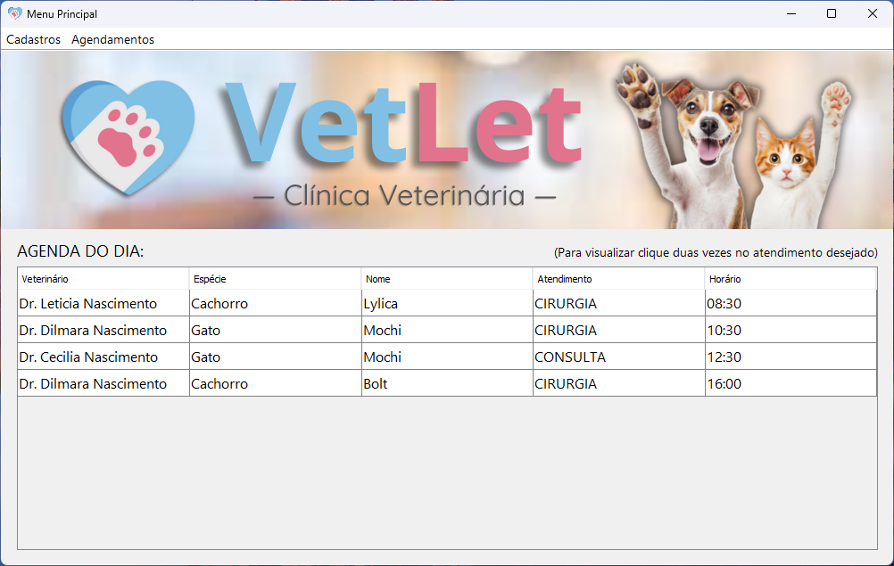
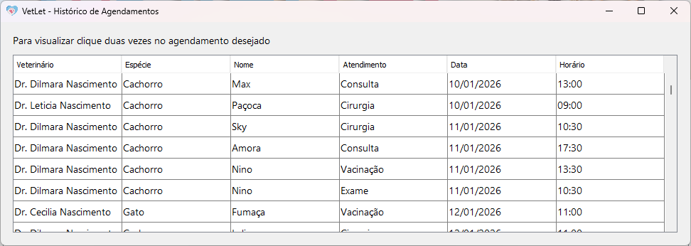

# Gerenciador de Agendamentos para Clínica Veterinária

## Sobre 

O projeto foi o trabalho final para a disciplina de Programação Orientada a Objetos durante o curso de Engenharia de Software, ministrada pelo Prof. Dr. Mayrton Dias de Queiroz.

Implementa um sistema em Java para simular o dia a dia de uma clínica veterinária, permitindo o gerenciamento completo de tutores, animais (pets) e veterinários, além do agendamento de atendimentos. 

## Funcionalidades Principais

O sistema conta com uma interface gráfica amigável desenvolvida em Swing, oferecendo as seguintes funcionalidades:

* **Gestão de Cadastros (CRUD):**
    * **Tutores:** Cadastro completo com validação de dados (Nome, CPF, Endereço, Telefone).
    * **Pets:** Registro detalhado dos animais (Nome, Espécie, Raça, Peso, Histórico).
    * **Veterinários:** Cadastro da equipe médica da clínica.

* **Agendamentos e Atendimentos:**
    * Marcação de consultas vinculando um Tutor, um Pet e um Veterinário.
    * Verificação automática de disponibilidade de horário.
    * Histórico de procedimentos realizados.

* **Persistência de Dados:**
    * O sistema salva automaticamente todos os registros (Tutores, Pets, Veterinários e Atendimentos) em arquivos de texto (`.txt`), garantindo que os dados não sejam perdidos ao fechar a aplicação.

## Estrutura do Projeto

O código segue o padrão de arquitetura **MVC** (Model-View-Controller) para melhor organização e escalabilidade:

* **`src/clinicaveterinaria/Main.java`**: Classe principal que inicializa a aplicação e carrega os dados.
* **`view`**: Contém as telas da interface gráfica (`Menu`, `CadastrarTutor`, `VisualizarAtendimento`, etc.).
* **`model`**: Classes que representam as entidades do negócio (`Pet`, `Tutor`, `Veterinario`, `Atendimento`).
* **`controller`**: Camada responsável pela regra de negócio, validações e persistência dos dados (`PetController`, `TutorController`, etc.).
* **`util`**: Classes utilitárias para validação de dados (CPF, Email) e formatação.

## Tecnologias Utilizadas

* **Linguagem:** Java (JDK 17+)
* **Interface Gráfica:** Java Swing
* **IDE Recomendada:** NetBeans
* **Bibliotecas Externas:**
    * **[Caelum Stella Core](https://github.com/caelum/caelum-stella)**: Utilizada para validação robusta de CPFs brasileiros.
    * **[Commons Validator](https://commons.apache.org/proper/commons-validator/)**: Utilizada para validação segura de formatos de e-mail.

## Como Executar

1. Certifique-se de ter o **Java (JDK)** instalado.
2. Clone este repositório.
3. Abra o projeto no **NetBeans** (recomendado, pois o projeto utiliza a estrutura de arquivos desta IDE).
4. Compile e execute a classe principal.

## Screenshots da Interface

## Autor

Feito por **[Artur Saraiva Rabelo](https://github.com/artur-sres)**.

